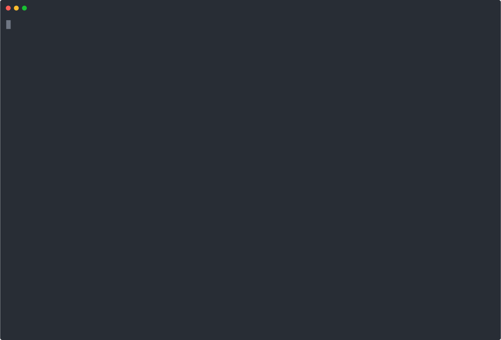

# OTel Demo for Causely

This project provides all the configurations needed to deploy the [OpenTelemetry Demo](https://opentelemetry.io/docs/demo/)
without the out of the box observability stack (Prometheus, Jaeger, Grafana, OpenSearch) and a custom OpenTelemetry collector configuration.

By default the configuration is for ingesting telemetry into the [Causely mediator](https://docs.causely.ai/getting-started/how-causely-works/#mediation-layer),
but it can be modified to work with other endpoints as well, just edit the [`values.yaml`](values.yaml) with the settings for your endpoints

```yaml
    exporters:
      otlp:
        endpoint: <URL_TO_YOUR_ENDPOINT>
```

## Installation

You can install the OpenTelemetry Demo using [helm](https://helm.sh/) and the [`values.yaml`](values.yaml) as provided in this repository:

```bash
helm repo add open-telemetry https://open-telemetry.github.io/opentelemetry-helm-charts
kubectl create namespace otel-demo
helm install my-otel-demo open-telemetry/opentelemetry-demo --namespace otel-demo -f https://raw.githubusercontent.com/causely-oss/otel-demo/refs/heads/main/values.yaml
```

After you have installed the demo, deploy Causely, following the instructions of the [Getting Started guide](https://docs.causely.ai/getting-started/quick-setup/), e.g.

```bash
TOKEN=eyJhbG...
causely agent install --token ${TOKEN}
```

Make sure that you enable the port forwarding for the frontend-proxy of the Demo to interact with the services (including the feature flag UI):

```bash
kubectl --namespace otel-demo port-forward svc/frontend-proxy 8080:8080
```

**Note**: If you use [minikube](https://minikube.sigs.k8s.io/docs/), make sure to run `minikube tunnel` in a separate terminal!

When you run the commands listed above you should see a flow like the following:

[](https://asciinema.org/a/ZVo6q69Kr4yHYRijt0YwGnJhv)

> [!TIP]
> The video above is recorded with [asciinema](https://asciinema.org/), which allows you
> to copy & paste out of the recording. Click on the image and give it a try!

## Usage

To simulate incidents in the deployed demo application go to <http://localhost:8080/feature> and toggle one of the available [feature flags](https://opentelemetry.io/docs/demo/feature-flags/).

After a while you will see the root cause for the scenario being detected by [Causely](https://www.causely.ai/).

## License

This project is licensed under the Apache 2.0 License.

## Contributing

Contributions are welcome. Please submit pull requests or open issues for any changes or improvements.
